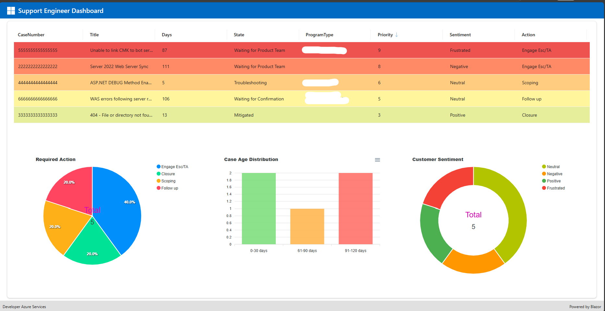
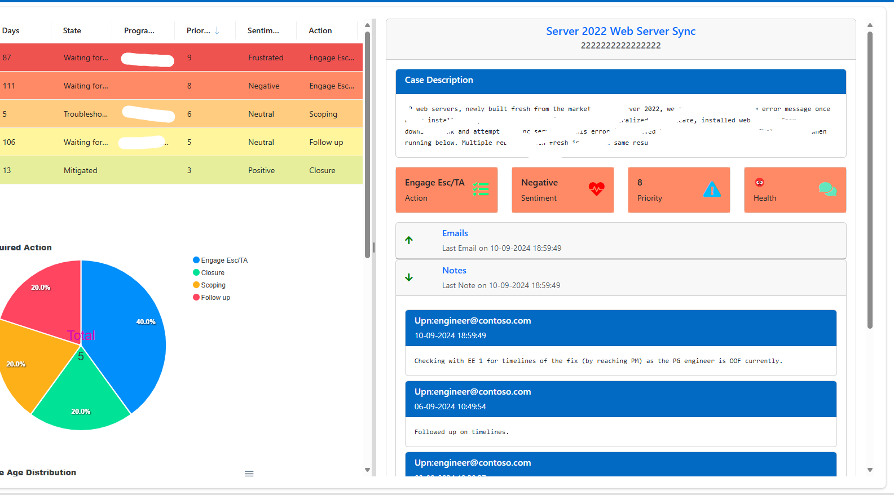
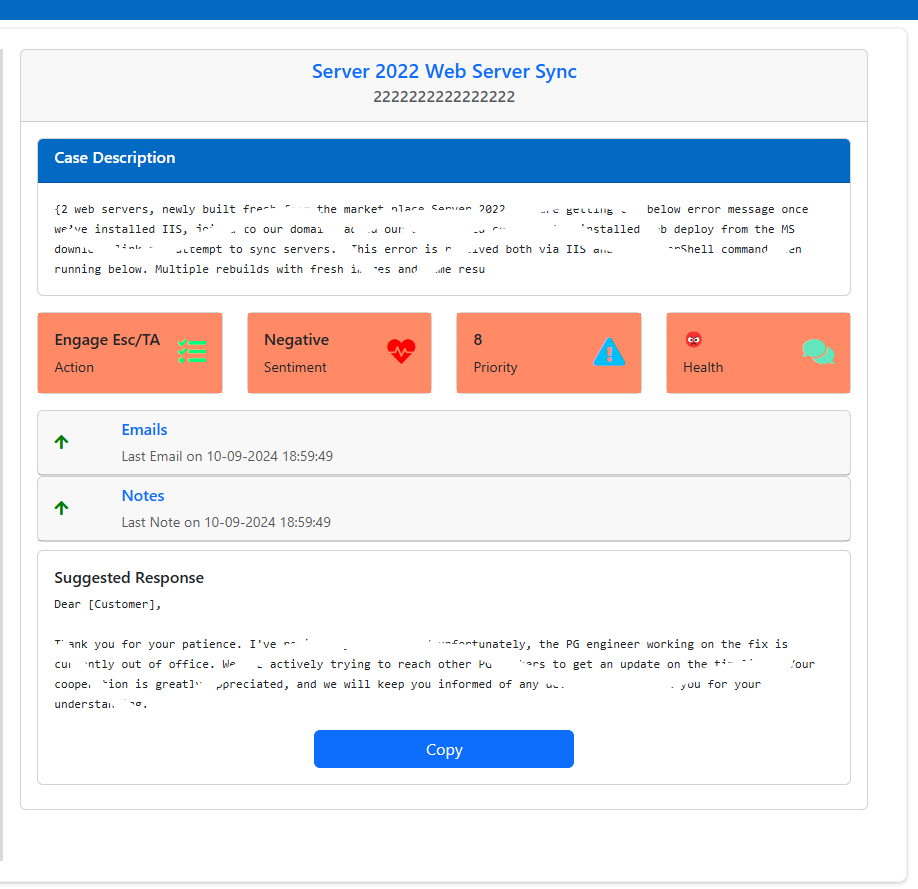

# Revolutionizing Support Efficiency

**AI-Powered Case Prioritization, Automated Follow-ups, and Data-Driven Insights to Save Time, Reduce Costs, and Elevate Customer Satisfaction**

---

## 📌 Overview

In today’s fast-paced support environment, managing a high volume of cases efficiently is essential to maintain customer satisfaction and operational effectiveness. Our solution leverages **Generative AI** to revolutionize how Support Engineers manage their day-to-day activities. By analyzing ongoing support cases, our system intelligently prioritizes those needing immediate attention, generates customized action plans, and automates follow-up communication.

---

## 🚀 Description

### 🔍 Opportunity

Support Engineers spend an average of **35–50 minutes daily** reviewing their case backlog for prioritization, planning, and follow-ups[^1]. Studies show that **inefficient prioritization** and **manual follow-ups** can extend resolution times by up to **34%**[^2][^3].

### 🤖 Solution

While existing tools like **Case Summary** and **Suggested Actions** offer partial support, engineers still need to manually review each case daily. Our AI-powered system addresses this gap by:

- Providing a **holistic view** of the engineer’s case bin
- **Prioritizing cases** based on urgency, support type, and customer sentiment
- **Automating follow-up emails** and technical action plans
- Delivering a **dashboard** with real-time insights on time and cost savings

### 💥 Impact

By saving at least **one hour per engineer per day**, this solution improves delivery team efficiency by over **11%**[^4], enhances customer satisfaction, reduces resolution times, and cuts operational costs[^5].

---

## 🎯 Project Goal

To enhance Support Engineer efficiency by integrating Generative AI solutions that:

- Prioritize support cases intelligently
- Provide customized action plans
- Automate follow-up reminders  
Resulting in faster, smarter, and more effective issue resolution.

---

## 💡 Key Benefits

### ✅ Increased Productivity
Automating manual tasks allows engineers to focus on critical problem-solving.

### 🤝 Enhanced Customer Satisfaction
Prompt, data-driven responses improve the overall customer experience.

### 📈 Improved Operational Efficiency
Reduces idle time and promotes smarter case management.
